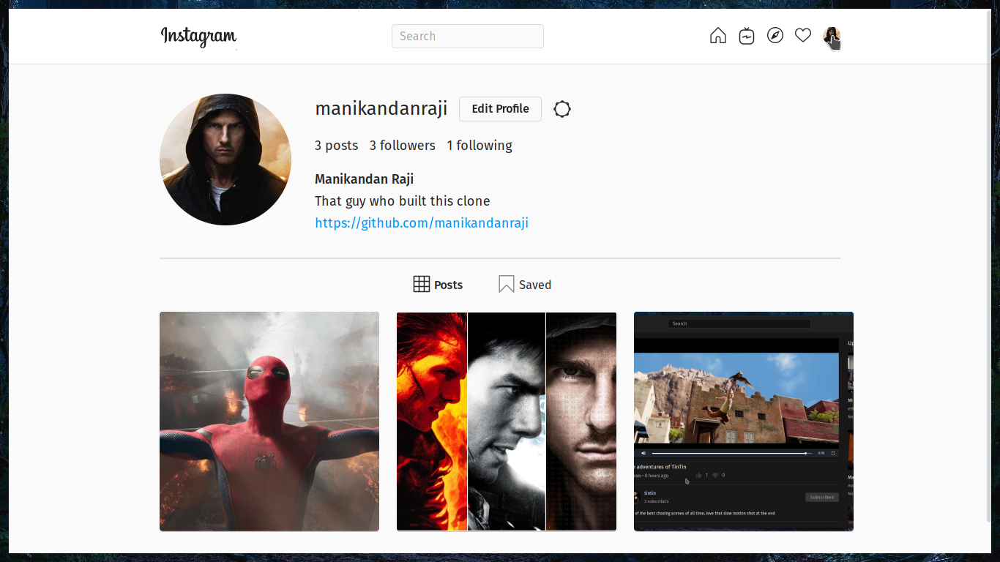
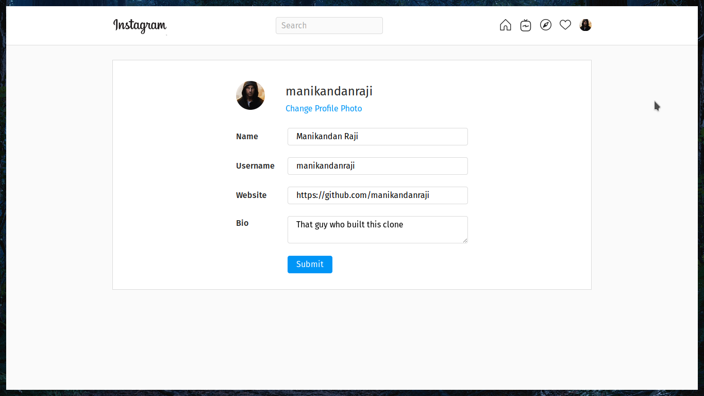

# Instaclone Backend

**NOTE: As of 10-06-2022 19:52 IST, I am archiving this repository. It was fun while it lasted.**

Instagram clone using MERN stack

This is the backend repo built with Express and MongoDB. If you looking for the frontend repo, [click here](https://github.com/manikandanraji/instaclone-frontend)

## Running Locally

At the root of the project, you should have a .env with the following contents

```js
JWT_SECRET=<yoursupersecret>
JWT_EXPIRE=30d // or anything you prefer
MONGOURI=<your_mongodb_connection_uri>
```

Then run <code>npm i && npm run dev</code> to start the development server

## Deploying the backend to heroku

First create an heroku account and install the heroku cli globally and login

```bash
npm i -g heroku
heroku login
```

Once logged in, create a new heroku application and push it to the remote 'heroku'

```bash
heroku create
git push heroku master
```
Then we need to manually setup the environmental variables using the heroku dashboard

## UI

### Home 


### Explore


### Followers


### Profile


### Edit Profile


### New Post

